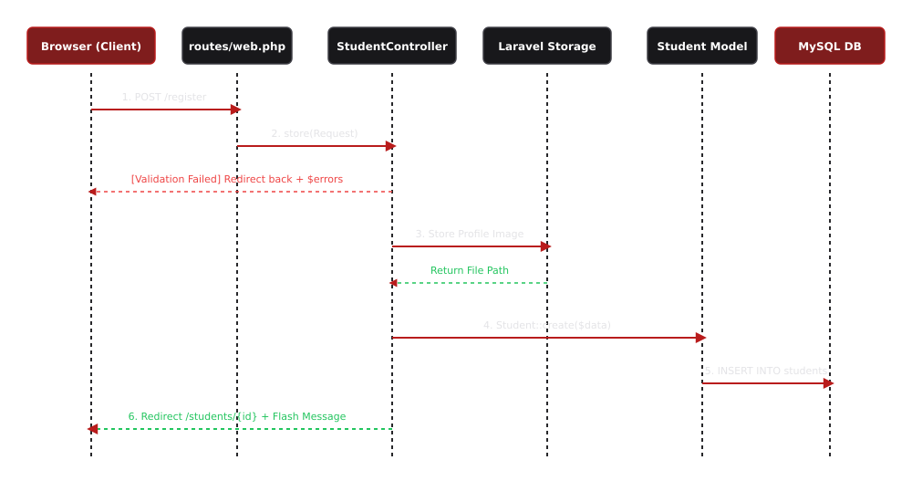
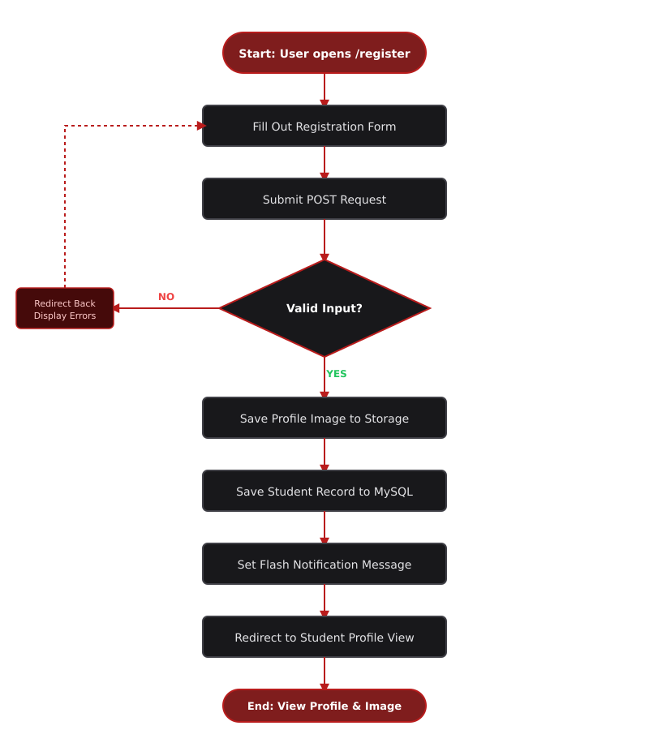

# Student Registration System

## 1. Project Title

**Student Registration System with Laravel Forms, Validation, and File Upload**  
*Built with Laravel 12, Blade Templating, MySQL, and External Tailwind CSS*

**Subject:** ITST 302 — Client-Server Technologies  
**Project:** Mini Project 03: Student Registration System  
**Course:** Bachelor of Science in Information Technology (BSIT)  

---

## 2. Introduction

In enterprise information systems, user registration is a fundamental building block. Educational institutions, municipal government units, financial services, and healthcare providers rely on secure, validated online registration modules to capture and manage critical data.

This project is a web application developed for the College of Information Technology using Laravel. It transitions traditional paper-based student registration into a secure digital system. The system captures student details, enforces server-side validation rules, stores uploaded profile images safely using Laravel Storage, and persists accurate records in a MySQL relational database.

---

## 3. Objectives

* Build a responsive multi-page student registration application using Laravel Blade templates.
* Process client HTTP POST and GET requests through dedicated controller methods.
* Implement server-side validation rules to enforce data integrity and prevent invalid submissions.
* Display session flash notifications and error feedback banners for user interactions.
* Manage secure file uploads and store relative image paths using Laravel Storage and symbolic links.
* Design and migrate a relational MySQL database table using Laravel Migrations.
* Maintain clean code organization by enforcing external CSS styling compiled via Vite.
* Apply structured version control using Git and maintain a public GitHub repository.

---

## 4. Laravel Request Lifecycle

Understanding how a registration request flows through the Laravel framework is essential for enterprise web application development.

### Execution Flow Breakdown

1. **Browser (Client):** The user fills out the registration form and submits a `POST` HTTP request containing form data and an uploaded profile image.
2. **Route (`routes/web.php`):** The router catches the incoming request and routes it to `StudentController@store`.
3. **Controller (`StudentController`):** The controller receives the request payload and executes server-side validation rules.
4. **Validation:** Laravel evaluates the field values against specified constraints (`required`, `unique`, `image`, `mimes`).
   * **If Invalid:** The request halts and redirects back with error messages and previous user input (`old()`).
   * **If Valid:** Processing continues.
5. **Model (`Student`):** The controller stores the image file inside `storage/app/public/profiles` and invokes `Student::create()` with validated data.
6. **Database (MySQL):** The Eloquent ORM translates the model invocation into an `INSERT INTO students` SQL query.
7. **Response (View/Redirect):** The controller sets a session flash notification (`Student registered successfully!`) and redirects to the student profile view (`students.show`).

---

## 5. Validation Rules

Server-side validation guarantees that only reliable, sanitized, and properly formatted data enters the system.

| Field Name | Validation Rules | Description / Purpose |
| :--- | :--- | :--- |
| `student_id` | `required\|unique:students,student_id` | Ensures unique identification number per student. |
| `first_name` | `required\|string\|max:100` | Mandatory text field capped at 100 characters. |
| `middle_name` | `nullable\|string\|max:100` | Optional field for students with middle names. |
| `last_name` | `required\|string\|max:100` | Mandatory text field capped at 100 characters. |
| `email` | `required\|email\|unique:students,email` | Validates email format and prevents duplicate user emails. |
| `mobile_number` | `required\|numeric` | Restricts input strictly to digits for contact numbers. |
| `date_of_birth` | `required\|date` | Enforces proper date formatting for administrative records. |
| `gender` | `required` | Mandatory selection for demographic records. |
| `program` | `required` | Specifies enrolled academic degree program (e.g., BSIT). |
| `year_level` | `required` | Indicates academic year level. |
| `address` | `required` | Full residential address details. |
| `profile_picture` | `required\|image\|mimes:jpg,jpeg,png\|max:2048` | Restricts uploads to valid images under 2MB (2048 KB). |

---

## 6. Database Design

### Table Name: `students`
* **Primary Key:** `id`
* **Unique Constraints:** `student_id`, `email`

| Column Name | Data Type | Nullable | Description / Constraints |
| :--- | :--- | :---: | :--- |
| `id` | `BIGINT` (Unsigned) | No | Auto-incrementing primary key |
| `student_id` | `VARCHAR(255)` | No | Unique student identification number |
| `first_name` | `VARCHAR(255)` | No | Student's given first name |
| `middle_name` | `VARCHAR(255)` | Yes | Optional middle name |
| `last_name` | `VARCHAR(255)` | No | Student's family last name |
| `email` | `VARCHAR(255)` | No | Unique contact email address |
| `mobile_number` | `VARCHAR(255)` | No | Contact phone number |
| `date_of_birth` | `DATE` | No | Student date of birth |
| `gender` | `VARCHAR(255)` | No | Selected gender |
| `program` | `VARCHAR(255)` | No | Academic degree program |
| `year_level` | `VARCHAR(255)` | No | Enrolled academic year |
| `address` | `TEXT` | No | Full residential street address |
| `profile_picture` | `VARCHAR(255)` | No | Relative path to uploaded file |
| `created_at` | `TIMESTAMP` | Yes | Record creation timestamp |
| `updated_at` | `TIMESTAMP` | Yes | Record modification timestamp |

---

## 7. Flowchart

---

## 8. Screenshots

| Screenshot Asset | Visual Preview |
| :--- | :---: |
| **Registration Form** |  |
| **Validation Errors** |  |
| **Successful Registration** |  |
| **Flash Message** |  |
| **Uploaded Profile Picture** |  |
| **Database Table** |  |
| **Student Profile Page** |  |
| **VS Code Project Structure** |  |
| **GitHub Repository** |  |
